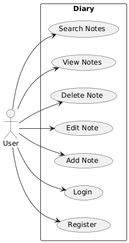

# DiaryApp

## Project Overview
- **Description**: A Java-based personal diary application that allows users to record daily notes, view previous entries, and search diary content.
- **Objective**: Provide a secure and user-friendly platform for maintaining a digital personal diary.

## Key Features
- User Registration
- Login/Authentication
- Add Note
- View Notes
- Search Notes
- Edit and Delete Notes

## Functional Requirements
- RF01: User registration
- RF02: Authentication of registered users
- RF03: Addition of new notes to the diary
- RF04: Viewing previous notes
- RF05: Keyword search in diary notes
- RF06: Editing and deleting notes

## Non-Functional Requirements
- RNF01: User data security
- RNF02: Responsiveness across different devices
- RNF03: Ease of use and intuitive interface
- RNF04: Scalability to support multiple users

## System Architecture
- **Presentation Layer**: User interface (JavaFX or Spring Boot with Thymeleaf)
- **Business Logic Layer**: Services handling business rules
- **Persistence Layer**: Interaction with PostgreSQL database
- **Security Layer**: Authentication and authorization management

## Use Case Diagram

Description of the main use cases:

- **User Registration**: Allows new users to register in the system.
- **Login**: Allows registered users to log into the system.
- **Add Note**: Allows users to add new notes to the diary.
- **Edit Note**: Allows users to edit existing notes in the diary.
- **Delete Note**: Allows users to delete notes from the diary.
- **View Notes**: Allows users to view their previous notes.
- **Search Notes**: Allows users to search for notes based on keywords.
- **Logout**: Allows users to log out of the system.
